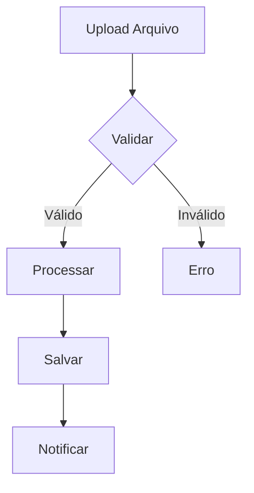
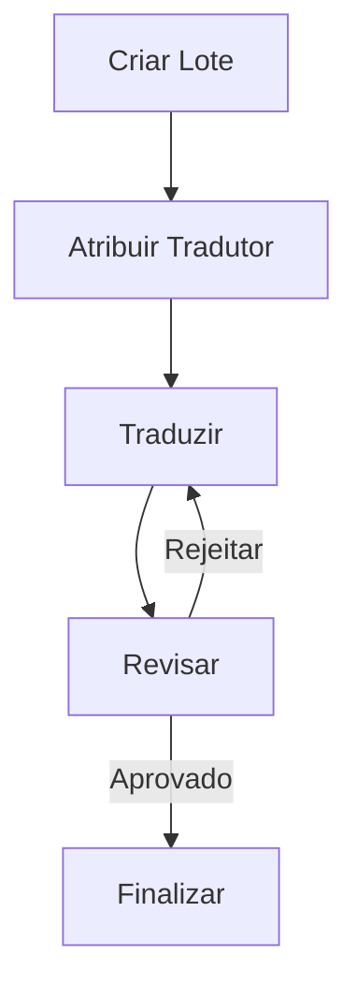

# Documentação Detalhada da Arquitetura

Este documento fornece uma visão técnica detalhada da arquitetura e organização do projeto, explicando cada componente, sua função e como é utilizado no sistema.

## Estrutura de Arquivos e Diretórios

### `/app` - Diretório Principal (Next.js App Router)

#### `/app/api` - Backend API Routes
- `/auth` - Autenticação e Autorização
  - `/login/route.ts`: Endpoint de login que valida credenciais e gera JWT
  - `/register/route.ts`: Cadastro de novos usuários com validação de dados
  - `/refresh/route.ts`: Renovação de tokens JWT expirados
  - `/logout/route.ts`: Invalidação de sessões ativas
- `/documents` - Gestão de Documentos
  - `/upload/route.ts`: Upload de arquivos com validação de formato
  - `/[id]/route.ts`: CRUD de documentos específicos
  - `/list/route.ts`: Listagem paginada com filtros
- `/batches` - Gerenciamento de Lotes
  - `/create/route.ts`: Criação de novos lotes de tradução
  - `/assign/route.ts`: Atribuição de tradutores
  - `/status/route.ts`: Acompanhamento de progresso
- `/users` - Gerenciamento de Usuários
  - `/[id]/route.ts`: CRUD de usuários
  - `/profile/route.ts`: Atualização de perfil
  - `/preferences/route.ts`: Configurações pessoais
- `/health` - Monitoramento
  - `/route.ts`: Verificação de status dos serviços

#### `/app/dashboard` - Interface Administrativa
- `/_components` - Componentes do Dashboard
  - `header.tsx`: Barra superior com:
    - Logo da aplicação
    - Menu de navegação principal
    - Notificações
    - Perfil do usuário
  - `sidebar.tsx`: Menu lateral contendo:
    - Links de navegação
    - Status do usuário
    - Atalhos rápidos
  - `search.tsx`: Busca global com:
    - Autocompletar
    - Filtros avançados
    - Histórico de buscas
  - `filters.tsx`: Filtros de dados com:
    - Seleção de data
    - Status
    - Categorias
    - Tags
- `/batches` - Gestão de Lotes
  - `page.tsx`: Lista principal de lotes
  - `[id]/page.tsx`: Detalhes do lote com:
    - Informações gerais
    - Documentos associados
    - Timeline de eventos
  - `create/page.tsx`: Formulário de criação com:
    - Seleção de documentos
    - Definição de prazos
    - Escolha de tradutores

### `/components` - Biblioteca de Componentes

#### `/components/ui` - Componentes Base
- `button.tsx`: Botão customizável
  - Variantes: primary, secondary, ghost, destructive
  - Estados: hover, focus, disabled
  - Props: size, variant, leftIcon, rightIcon
- `input.tsx`: Campo de entrada
  - Validação integrada
  - Máscaras de formato
  - Estados de erro
  - Ícones auxiliares
- `form.tsx`: Sistema de formulários
  - Validação com Zod
  - Gestão de estado com React Hook Form
  - Feedback visual de erros
  - Submissão assíncrona
- `dialog.tsx`: Modais e diálogos
  - Animações suaves
  - Gestão de foco
  - Fechamento com ESC
  - Overlay customizável
- `table.tsx`: Tabelas interativas
  - Ordenação por coluna
  - Paginação
  - Seleção múltipla
  - Busca e filtros
- `pdf-viewer.tsx`: Visualizador PDF
  - Zoom e navegação
  - Anotações
  - Extração de texto
  - Marcadores

### `/lib` - Utilitários e Configurações
- `auth.ts`: Sistema de autenticação
  ```typescript
  // Exemplo de uso
  const auth = await verifyAuth(req);
  if (!auth) return unauthorized();
  ```
- `prisma.ts`: Cliente do banco de dados
  ```typescript
  // Exemplo de uso
  const user = await prisma.user.findUnique({
    where: { id }
  });
  ```
- `utils.ts`: Funções utilitárias
  ```typescript
  export const formatDate = (date: Date) => {
    return new Intl.DateTimeFormat('pt-BR').format(date);
  };
  ```

### `/services` - Lógica de Negócios
- `document.service.ts`: Gerenciamento de documentos
  ```typescript
  class DocumentService {
    async create(data) {
      // Validação e processamento
      const doc = await prisma.document.create({ data });
      return doc;
    }
  }
  ```
- `batch.service.ts`: Gestão de lotes
  ```typescript
  class BatchService {
    async assignTranslator(batchId, translatorId) {
      // Lógica de atribuição
      return await prisma.batch.update({/*...*/});
    }
  }
  ```

### `/hooks` - Hooks React Customizados
- `useAuth.ts`: Gestão de autenticação
  ```typescript
  const { user, login, logout } = useAuth();
  ```
- `useDocuments.ts`: Operações com documentos
  ```typescript
  const { documents, isLoading, error } = useDocuments();
  ```

### `/prisma` - Banco de Dados
- `schema.prisma`: Definição do banco
  ```prisma
  model User {
    id        String   @id @default(uuid())
    email     String   @unique
    name      String
    role      Role     @default(USER)
    createdAt DateTime @default(now())
  }
  ```

## Fluxos de Trabalho Detalhados

### 1. Upload de Documento


### 2. Processo de Tradução


## Padrões de Código

### Componentes React
```typescript
interface ButtonProps {
  variant: 'primary' | 'secondary';
  size: 'sm' | 'md' | 'lg';
  children: React.ReactNode;
}

export const Button = ({ variant, size, children }: ButtonProps) => {
  return (
    <button className={`btn-${variant} btn-${size}`}>
      {children}
    </button>
  );
};
```

### Serviços
```typescript
export class UserService {
  private readonly prisma: PrismaClient;

  constructor() {
    this.prisma = new PrismaClient();
  }

  async createUser(data: CreateUserDTO): Promise<User> {
    const hashedPassword = await bcrypt.hash(data.password, 10);
    return this.prisma.user.create({
      data: { ...data, password: hashedPassword }
    });
  }
}
```

## Boas Práticas

### 1. Componentes
- Nomenclatura clara e descritiva
- Props tipadas com TypeScript
- Documentação com JSDoc
- Testes unitários

### 2. API
- Validação de entrada
- Tratamento de erros
- Logging consistente
- Cache quando apropriado

### 3. Banco de Dados
- Migrations versionadas
- Índices otimizados
- Relacionamentos bem definidos
- Backups automáticos

## Segurança

### 1. Autenticação
- JWT com rotação de tokens
- Senhas hasheadas com bcrypt
- Sessions seguras
- CSRF protection

### 2. API
- Rate limiting
- Validação de entrada
- Sanitização de dados
- Headers seguros

### 3. Upload de Arquivos
- Validação de tipo
- Limite de tamanho
- Scan de vírus
- Armazenamento seguro

## Performance

### 1. Frontend
- Code splitting
- Lazy loading
- Otimização de imagens
- Caching

### 2. Backend
- Query optimization
- Connection pooling
- Caching em memória
- Task queuing

## Monitoramento

### 1. Logs
- Error tracking
- User actions
- Performance metrics
- Security events

### 2. Métricas
- Response times
- Error rates
- Resource usage
- User engagement

## Contribuindo

### 1. Setup
```bash
git clone <repo>
npm install
npm run dev
```

### 2. Desenvolvimento
```bash
# Criar branch
git checkout -b feature/nova-funcionalidade

# Executar testes
npm run test

# Build local
npm run build
```

### 3. Commits
Seguir padrão convencional:
- feat: nova funcionalidade
- fix: correção de bug
- docs: documentação
- style: formatação
- refactor: refatoração
- test: testes
- chore: manutenção

### 4. Pull Requests
- Descrição clara
- Testes incluídos
- Screenshots se visual
- Checklist de revisão

Este documento é mantido atualizado e serve como referência principal para desenvolvedores trabalhando no projeto. Para dúvidas ou sugestões, consulte a equipe de desenvolvimento.